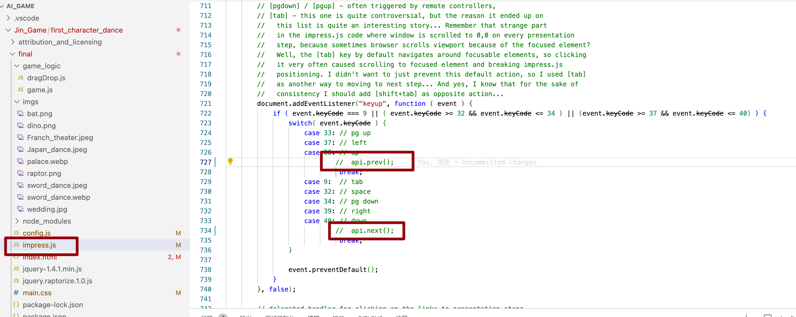
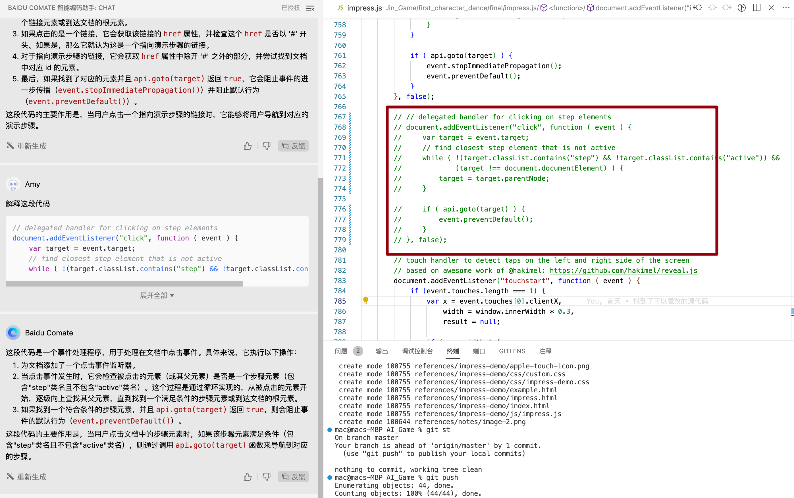
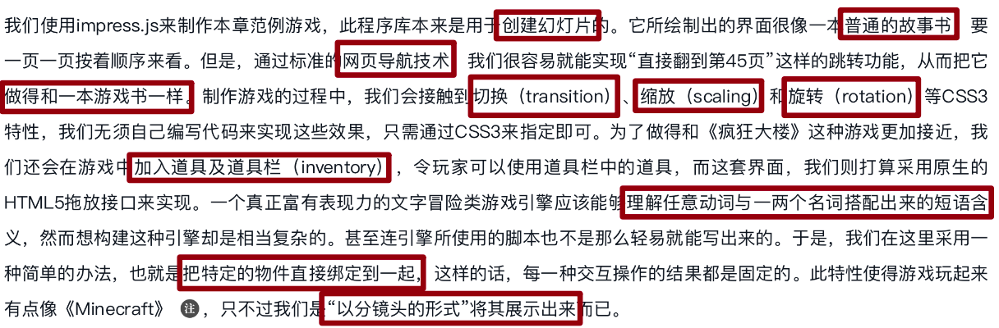

# 参考资料
## impress.js
1. [impress.js使用指南](https://www.195440.com/1819)
   1. 三个文件：impress.js（提供特效支持，核心库） + impress.css(样式支持) + index.html（幻灯片入口）
2. [一些在线例子](https://www.195440.com/1858)
   1. http://scottcheng.github.io/revolutionary-css3/
3. [官方示例在线看](http://static.runoob.com/assets/impress-demo/index.html)
4. [impress.js 源码分析](https://segmentfault.com/a/1190000003018108)
5. 

## 千帆接口使用
1. https://cloud.baidu.com/qianfandev/topic/267210

# 魔改记录
1. 找到源码里把上下左右切换幻灯片的代码给注释掉了，这样就可以让用户只能闯过一关又一关才能往下走剧情
   
2. 找到源码里把点击会切换幻灯片的代码给注释掉了，这样点击也不会随意到达其他幻灯片了
    
3. 

# TODOs

在impress.js制作的故事书中加入打字游戏是一个有趣的想法。下面是一种可能的实现思路：

1. 创建打字游戏区域：首先，你需要在故事书的某个幻灯片上创建一个打字游戏区域。这个区域可以是一个
元素，并使用CSS设置其样式和位置。
2. 添加打字内容：接下来，你需要为打字游戏添加内容。你可以在HTML中插入文本，或者使用JavaScript动态生成文本。这些文本可以是一些故事中的关键词或短语，也可以是随机的字母或单词。
3. 实现打字反馈：当用户在打字游戏区域输入文字时，你需要实现一种反馈机制。可以使用JavaScript监听用户的输入事件，然后与正确的答案进行比较。如果输入正确，可以显示一些视觉效果，例如更改文字颜色或添加动画效果，来告知用户他们已经正确输入了内容。
4. 设置打字游戏规则：你需要定义游戏的规则，例如每个正确的输入可以得多少分，游戏的时间限制等。这些规则可以通过JavaScript来实现。
5. 整合到impress.js：最后，你需要将这个打字游戏整合到impress.js的演示中。你可以使用impress.js的API来控制幻灯片的显示和切换。例如，你可以在演示的某个特定幻灯片上显示打字游戏，然后在其他幻灯片上显示其他内容。

使用impress.js进行游戏故事书的制作需要一些技巧和步骤。虽然impress.js主要是一个用于创建演示文稿的库，但你可以使用它来制作游戏故事书的一些幻灯片。以下是一些建议和步骤，帮助你使用impress.js制作游戏故事书：

1. 了解impress.js的基本用法：首先，你需要熟悉impress.js的基本语法和API。你可以查看impress.js的官方文档或示例，了解如何创建幻灯片和添加动画效果。
2. 准备故事书的素材：在开始制作之前，你需要准备好故事书的素材，包括故事的文本、图片、音频等。你可以将文本内容分成若干个幻灯片，并为每个幻灯片添加相关的图片和音频素材。
3. 定制幻灯片的样式：impress.js允许你定制幻灯片的样式。你可以使用CSS样式表来设置幻灯片的背景、字体、颜色等。根据故事书的主题和风格，为每个幻灯片添加适当的样式。
4. 添加交互性和动画效果：impress.js提供了丰富的交互和动画效果，你可以利用这些效果来增强故事书的互动性和吸引力。例如，你可以使用impress.js的API在幻灯片之间添加转场效果，或者使用JavaScript代码为故事书添加一些交互元素，如按钮、链接等。
5. 预览和发布：完成制作后，你可以使用impress.js提供的预览功能来查看你的故事书。确保每个幻灯片都能够正常显示，并且动画和交互效果能够正确工作。如果一切正常，你就可以将你的故事书发布为HTML文件，以便在网页上分享和展示。
需要注意的是，impress.js主要用于创建演示文稿，而不是专门用于制作游戏故事书。因此，如果你需要制作复杂的游戏故事书，可能需要结合其他工具或库来实现所需的功能。