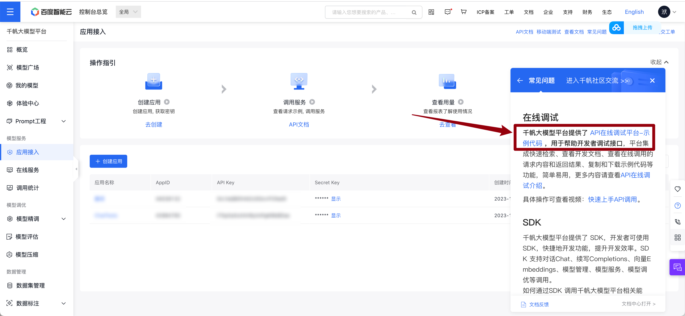
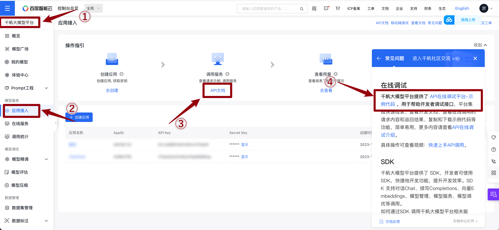
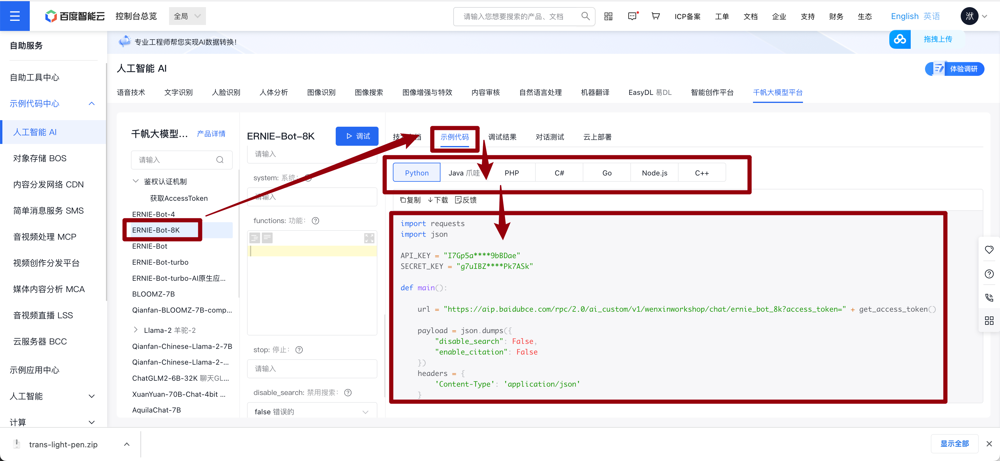
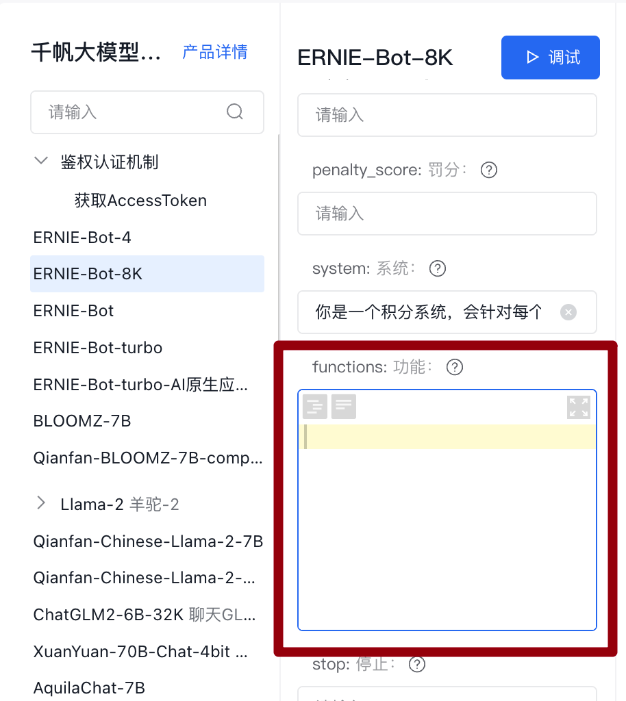
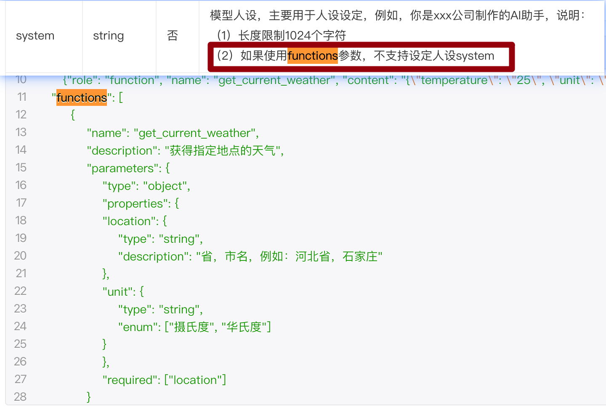
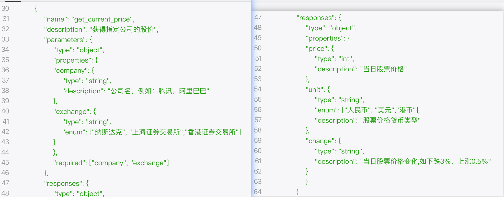
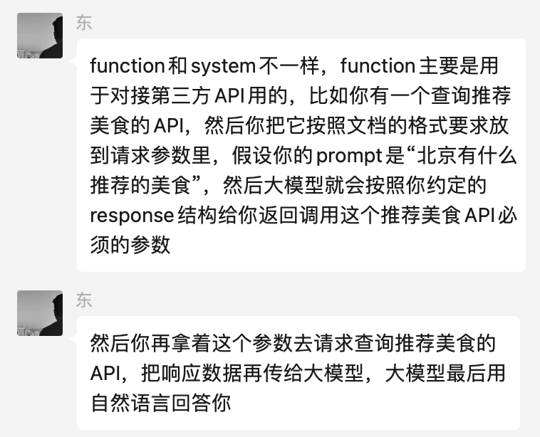

# 目录说明
通过百度智能云千帆大模型平台，在线调试功能，获得可用代码

# 具体步骤
1. 从[千帆大模型平台应用接口](https://console.bce.baidu.com/qianfan/ais/console/applicationConsole/application)处，通过API文档，找到在线调试入口
 
2. 选中需要的模型服务后，可直接查看示例代码
   
3. 还可设置 system 和 在对话测试处输入想要的内容，这样可以测试prompt效果，也可以直接获得可使用的代码
   
4. 更多详细说明可见[文档中心](https://cloud.baidu.com/doc/WENXINWORKSHOP/s/6lp69is2a)

# TODO
1. 学习functions的用法
   
   1. function与system prompt不能共用
   
   2. function可以设置response
   

   emm，网页编程门外汉表示post这些的玩法好难理解

   3. 还需要好好理解一下这个描述
   